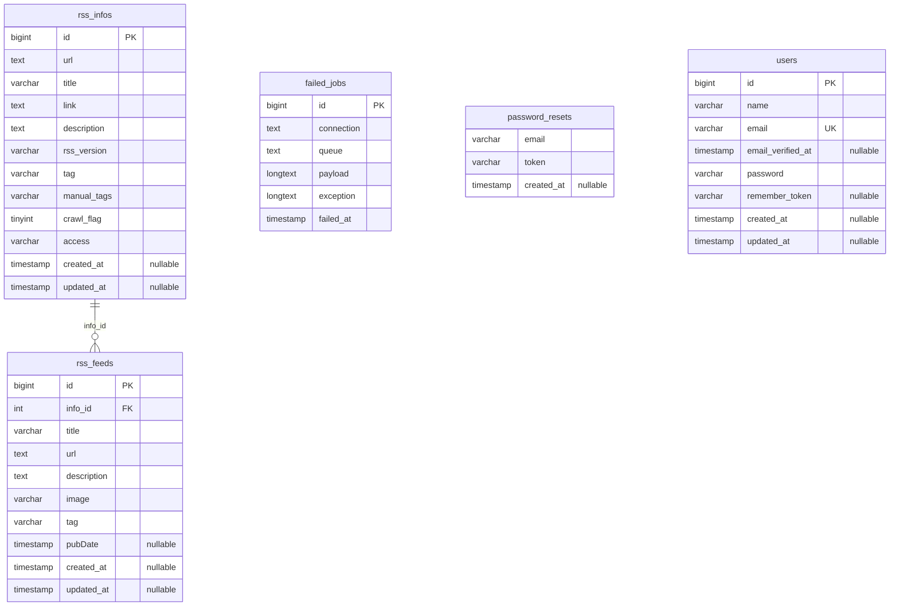

# ER図

`php artisan erd:generate` で自動生成しています。

<!-- ER_DIAGRAM:START -->

```mermaid
erDiagram
    rss_infos ||--o{ rss_feeds : "info_id"

    failed_jobs {
        bigint id PK
        text connection
        text queue
        longtext payload
        longtext exception
        timestamp failed_at
    }

    password_resets {
        varchar email
        varchar token
        timestamp created_at "nullable"
    }

    rss_feeds {
        bigint id PK
        int info_id FK
        varchar title
        text url
        text description
        varchar image
        varchar tag
        timestamp pubDate "nullable"
        timestamp created_at "nullable"
        timestamp updated_at "nullable"
    }

    rss_infos {
        bigint id PK
        text url
        varchar title
        text link
        text description
        varchar rss_version
        varchar tag
        varchar manual_tags
        tinyint crawl_flag
        varchar access
        timestamp created_at "nullable"
        timestamp updated_at "nullable"
    }

    users {
        bigint id PK
        varchar name
        varchar email UK
        timestamp email_verified_at "nullable"
        varchar password
        varchar remember_token "nullable"
        timestamp created_at "nullable"
        timestamp updated_at "nullable"
    }
```

<!-- ER_DIAGRAM:END -->
